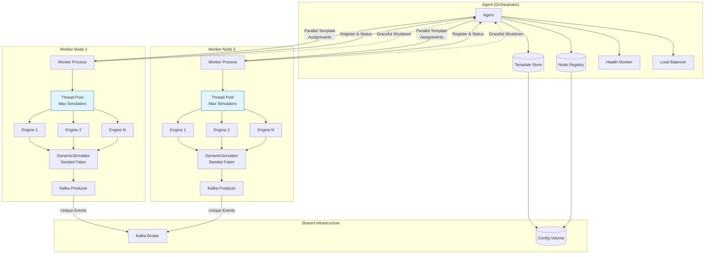

# Multi-Node Analytics Simulator Architecture

## Overview
The enhanced analytics simulator architecture supports deploying simulators across multiple nodes with dynamic creation based on configuration templates. It includes a generic simulator maker that interprets template fields to generate events, layered configurations, and a coordinator-based distribution system.

## Key Components

### 1. Generic Simulator Maker
- **DynamicSimulator**: A generic implementation of BaseSimulator that reads field definitions from templates and dynamically generates events.
- **FieldGenerator Interface**: Defines how to generate values for different field types (uuid, phone, random_int, now, etc.).
- **Registry Update**: Modified to instantiate DynamicSimulator for all simulator types, falling back to specific implementations if needed.
- **Data Uniqueness**: Each simulator instance uses node ID and simulator ID as seeds for Faker and random generators to ensure unique data across nodes and parallel instances.

### 2. Configuration Hierarchy
- **Global Config**: Kafka brokers, coordinator URL, default settings (environment variables or application.properties).
- **Node Config**: Node ID, max concurrent simulators, resource limits (node-specific properties).
- **Simulator Config**: Template JSON files with id, type, rate, parallel, batch_size, duration, fields, output.

### 3. Multi-Node Architecture
- **Agent (Orchestrator)**: Central orchestration agent that manages the distributed simulator deployment, monitors node health, distributes templates dynamically, and ensures load balancing across the cluster.
- **Coordinator Service**: Component of the Agent that handles template storage, node registry, and assignment logic.
- **Worker Nodes**: Individual JVM processes that register with the Agent, receive template assignments, and run multiple simulator engines in parallel.
- **Node-Level Parallel Simulators**: Each worker node maintains a thread pool (ExecutorService) to execute multiple Engine instances concurrently, respecting the max.simulators configuration to prevent resource exhaustion.
- **Worker-Level Parallel Operation**: The Agent distributes templates across available worker nodes in parallel, enabling simultaneous execution of different simulators across the cluster while maintaining thread pool limits per node.
- **Communication**: REST API for node registration, template assignment, status reporting, and dynamic scaling commands.
- **Agent Orchestration**: The Agent continuously monitors node status, redistributes load on node failures, scales worker instances, and provides centralized control for starting/stopping simulator campaigns.

### 4. Parallel Execution
- **Node Parallelism**: Worker nodes execute multiple simulators concurrently using ExecutorService with configurable thread pools.
- **Cluster Parallelism**: Multiple worker nodes operate in parallel, each handling assigned simulators independently.
- **Data Isolation**: Each simulator instance maintains separate Faker instances seeded with unique identifiers to prevent data duplication.

### 5. Destruction and Lifecycle Management
- **Graceful Shutdown**: Implement shutdown hooks for SIGTERM/SIGINT handling.
- **Simulator Cleanup**: Stop running engines, flush Kafka producers, close connections.
- **Node Deregistration**: Workers notify coordinator before shutdown, allowing reassignment of simulators.
- **Coordinator Cleanup**: Remove inactive nodes, persist running state.

### 6. Deployment
Using Docker Compose for local multi-node testing:
- Coordinator container
- Multiple worker containers (scaled via compose)
- Kafka broker container
- Shared volume for templates/config

## Architecture Diagram



## Communication Protocol
- **Node Registration**: Workers POST to /register with node info.
- **Template Assignment**: Coordinator assigns via POST /assign-template.
- **Status Updates**: Workers periodically POST status to /status.
- **Template Management**: Admin API for adding/removing templates.

## Template Distribution Strategy
- Templates stored in shared volume or database.
- Coordinator maintains queue of pending simulators.
- Round-robin or load-based assignment to registered nodes.
- Nodes acknowledge receipt and report completion.

## Configuration Schema

### Global Config (application.properties)
```
kafka.brokers=localhost:9092
coordinator.url=http://coordinator:8080
default.rate.per_second=1
```

### Node Config (node.properties)
```
node.id=worker-1
max.simulators=10
resource.cpu.limit=4
```

### Simulator Template (JSON)
```json
{
  "id": "cdr-sim-1",
  "type": "cdr",
  "rate": {"per_second": 5},
  "parallel": 2,
  "batch_size": 1,
  "duration": 3600,
  "fields": {
    "eventId": {"type": "uuid"},
    "timestamp": {"type": "now"},
    "value": {"type": "random_int", "min": 1, "max": 100}
  },
  "output": {"topic": "events", "format": "json"}
}
```

## Implementation Plan
1. Implement DynamicSimulator with FieldGenerator support and seeded uniqueness using node/simulator IDs.
2. Update Registry to use DynamicSimulator for all types with seeded Faker instances.
3. Create Agent orchestration service with health monitoring, load balancing, and dynamic scaling.
4. Implement Coordinator component within Agent for template management and node registry.
5. Modify Main/Engine to support multi-simulator parallel execution with configurable thread pools (node-level parallelism).
6. Add worker-level parallel operation through Agent's distributed assignment across nodes.
7. Implement graceful shutdown handling, node deregistration, and simulator cleanup procedures.
8. Add configuration loading from multiple sources (global, node, simulator).
9. Create Docker Compose setup with Agent and scalable worker containers.
10. Test single-node dynamic simulation with uniqueness and thread pool management.
11. Test multi-node deployment with Agent orchestration and parallel distributed execution.

## Generating Diagram as Image
To generate the architecture diagram as a PNG image:

1. Install Mermaid CLI: `npm install -g @mermaid-js/mermaid-cli`
2. Save the Mermaid code above to a file (e.g., `diagram.mmd`)
3. Run: `mmdc -i diagram.mmd -o architecture.png -t dark`

Alternatively, use online tools like:
- GitHub (renders Mermaid in Markdown)
- Mermaid Live Editor: https://mermaid.live/
- VSCode with Mermaid preview extension

## Architecture Diagram v2
```mermaid
graph TD

    subgraph "Agent (Control Plane)"
        Coordinator[Coordinator Service] --> TemplateRegistry[(Simulator Template Registry)]
        Coordinator --> NodeRegistry[(Node Registry)]
        Coordinator --> AssignmentEngine[Assignment Engine]
        AgentMonitor[Health Monitor] --> Coordinator
        LoadBalancer[Load Balancer] --> AssignmentEngine
    end

    subgraph WorkerNode1["Worker Node 1 (Execution Plane)"]
        A1[Main] --> B1[Engine]
        B1 --> D1[Registry]
        B1 --> E1[KafkaIO]
        B1 --> F1[Scheduler]
        D1 --> G1[CDRSimulator]
        D1 --> H1[DeviceSimulator]
        D1 --> I1[SSESimulator]
        G1 --> J1[BaseSimulator]
        H1 --> J1
        I1 --> J1
        E1 --> L1[Kafka Producer]
        F1 --> M1[Rate Controller]
    end

    subgraph WorkerNode2["Worker Node 2 (Execution Plane)"]
        A2[Main] --> B2[Engine]
        B2 --> D2[Registry]
        B2 --> E2[KafkaIO]
        B2 --> F2[Scheduler]
        D2 --> G2[CDRSimulator]
        D2 --> H2[DeviceSimulator]
        D2 --> I2[SSESimulator]
        G2 --> J2[BaseSimulator]
        H2 --> J2
        I2 --> J2
        E2 --> L2[Kafka Producer]
        F2 --> M2[Rate Controller]
    end

    subgraph "Shared Infrastructure"
        Kafka[Kafka Broker]
        ConfigVolume[(Config Volume)]
    end

    %% Communication Flows
    AssignmentEngine -->|Assign Templates| WorkerNode1
    AssignmentEngine -->|Assign Templates| WorkerNode2

    WorkerNode1 -->|Register/Status| Coordinator
    WorkerNode2 -->|Register/Status| Coordinator
    WorkerNode1 -.->|Graceful Shutdown| Coordinator
    WorkerNode2 -.->|Graceful Shutdown| Coordinator

    L1 -->|Unique Events| Kafka
    L2 -->|Unique Events| Kafka

    TemplateRegistry --> ConfigVolume
    NodeRegistry --> ConfigVolume

    classDef registry fill:#f3e5f5,stroke:#6a1b9a
    class TemplateRegistry,NodeRegistry registry

    classDef runtime fill:#e1f5fe,stroke:#01579b
    class B1,D1,E1,F1,G1,H1,I1,J1,L1,M1,B2,D2,E2,F2,G2,H2,I2,J2,L2,M2 runtime
    ```
